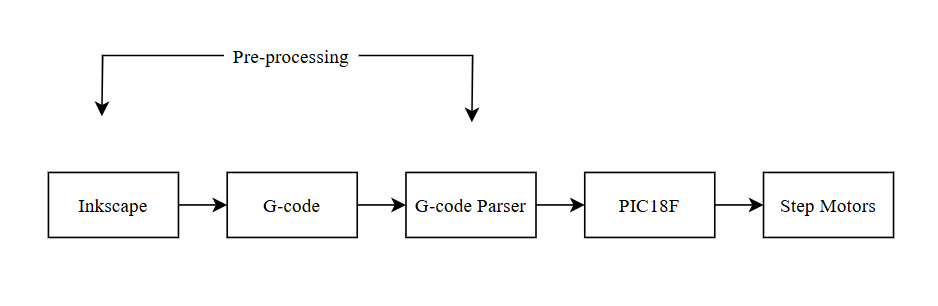

<h1 align="center">
 CNC Drawing Machine
</h1>

 Patrick Nguyen

 Department of Electrical and Computer Engineering, Cal Poly Pomona

 ECE 3301 Intro to Microcontrollers  

<h1 align="left">
Project Summary
</h1>
 

   This project aims to create a CNC Drawing machine using a PIC microcontroller. We create our own custom firmware that drives the two step motors using embedded C and a G-code parser to convert g-code into C instructions compatible with our custom firmware. G-code is generated from a digital drawing that a user wants to draw using the Inkscape drawing program and an extension. A video demo is shown below:
 

 

   
 

## Overview
The mechanical gantry design we 3D printed was borrowed from thingiverse (https://www.thingiverse.com/thing:2349232). It uses NEMA 17 stepper motors to control the XY movements of the gantry and an sg90 microservo to control the Y axis movement of the pen. While the thingiverse project uses an Arduino UNO, a CNC shield (which is pre-assembled circuitry for connecting the arduino to the stepper motors), and GRBL (Arduino CNC firmware), we will create our own versions of a CNC shield and GRBL. We also use a PIC18F4620 development board instead of the Arduino UNO. 

 In order to draw an image we make use of some pre-existing technologies. The drawing program Inkscape is used to draw images. From there G-code is generated using the J Tech Photonics Laser extension: 
 https://jtechphotonics.com/?page_id=2012

 From there, the g-code is parsed using python. The g-code is converted to embedded C functions. The output from the g-code parser is programmed onto the microcontroller memory along with our motor control algorithms.

 In between the microcontroller and NEMA 17 stepper motors are A4988 drivers. The microcontroller will output to the drivers through GPIO signals and to the servo through PWM. The firmware will dictate the GPIO and PWM signals based on the uploaded C instructions.
 
